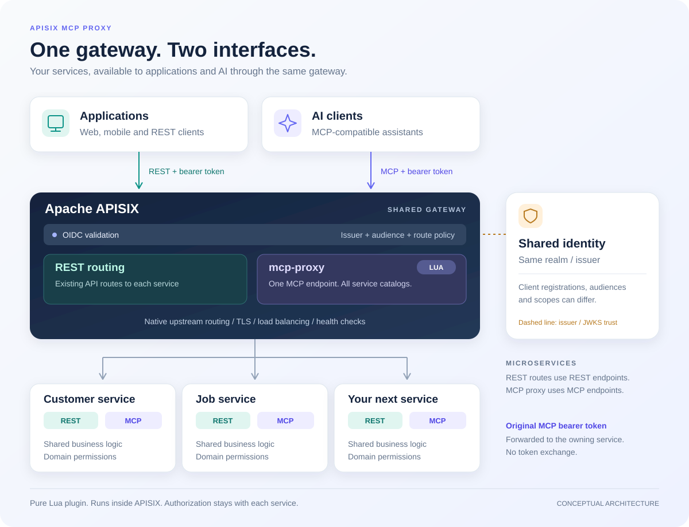

# APISIX MCP Proxy

Expose the MCP interfaces of multiple microservices through one authenticated
endpoint in Apache APISIX. Clients can discover and use tools, prompts and
resources across your services through a single MCP connection.

Each service keeps its own MCP implementation, business logic and authorization.
The plugin combines their catalogs and routes each request to the service that
owns the requested tool, prompt or resource. APISIX handles authentication,
upstream routing, load balancing and TLS.

Use it when your services already expose MCP interfaces and you want to make
them available through the same gateway as your REST APIs. REST and MCP routes
can share an identity provider and realm, with audiences and permissions
configured for each interface.

## How it works



1. An MCP client connects to the gateway and authenticates through the configured
   APISIX authentication plugin.
2. Catalog requests collect tools, prompts, resources and resource templates from
   the configured services using the caller's bearer token.
3. The plugin combines the results, applies configured aliases and hiding rules,
   and returns one catalog to the client.
4. Tool calls and other operations go to the service that owns them. Responses
   and streaming progress are returned to the client.

Services continue to enforce their own tenant and operation permissions. REST
traffic uses its existing APISIX routes. The plugin works with existing MCP
servers; it does not generate MCP tools from REST APIs.

The plugin runs entirely in Lua inside APISIX. It supports stateless MCP
2025-11-25 over Streamable HTTP, including streamed POST responses. Installation
adds Lua files to APISIX; no separate proxy process is required.

## Contents

- [Installation](#install)
- [Petstore example](#example-petstore-microservices)
- [Configuration reference](#configuration-reference)
- [Authentication and public identity](#authentication-and-public-identity)
- [Versions and protocol profile](#versions-and-protocol-profile)
- [Resource contract](#resource-contract)
- [TLS and streaming](#tls-and-streaming)
- [Error mapping and unsupported features](#error-mapping-and-unsupported-features)
- [Test and development](#test-and-development)

## Versions and protocol profile

The supported runtime is **Apache APISIX 3.19.0** with APISIX-Runtime
extensions. Both client-facing and upstream MCP connections use the
**2025-11-25 stateless Streamable HTTP** profile. See the
[verification report](docs/verification.md) for the tested images and fixtures.

Connections use `initialize` followed by `notifications/initialized`.
An authenticated, structurally valid `server/discover` request
receives HTTP 404 with JSON-RPC `-32601`, including probes carrying
`MCP-Protocol-Version: 2026-07-28` or no version header, so clients can fall back
to `initialize`. This allows fallback without advertising support for a newer
protocol. Origin, body, JSON-RPC and public authentication/IP checks still
apply. Other methods retain strict version checking.
A client proposing another revision in `initialize` receives 2025-11-25 and must
disconnect if it does not support that revision. Subsequent requests must carry
`MCP-Protocol-Version: 2025-11-25`.

No downstream session ID is allocated. Each upstream interaction initializes the
selected stateless server, checks its negotiated capabilities/version, then sends
`notifications/initialized`. An upstream returning `Mcp-Session-Id` fails with an
explicit incompatibility diagnostic. It is never silently ignored or exposed as
an aggregate session. This profile needs no affinity, Redis or shared protocol
session across workers/instances. A stateful deployment requires a separately
designed and verified session strategy before it can use this plugin.

## Install

Installation follows APISIX's [custom Lua plugin loading model](https://apisix.apache.org/docs/apisix/plugin-develop/):
files under `apisix/plugins`, an `extra_lua_path`, and an entry in `plugins`.
The repository layout also follows the [API7 Lua plugin template](https://github.com/api7/apisix-plugin-template).
This is an independently maintained plugin, not an Apache-distributed plugin.

### 1. Obtain and install the Lua files

Download the Lua distribution and SHA-256 checksum from
[GitHub Releases](https://github.com/jattsson/apisix-mcp-proxy/releases/tag/v0.1.1):

```sh
curl -fLO https://github.com/jattsson/apisix-mcp-proxy/releases/download/v0.1.1/apisix-mcp-proxy-0.1.1.tar.gz
curl -fLO https://github.com/jattsson/apisix-mcp-proxy/releases/download/v0.1.1/SHA256SUMS
sha256sum -c SHA256SUMS
tar -xzf apisix-mcp-proxy-0.1.1.tar.gz
cd apisix-mcp-proxy-0.1.1
```

Alternatively, clone https://github.com/jattsson/apisix-mcp-proxy and check out
`v0.1.1`. This release is distributed as a tar archive; it is not published to
LuaRocks. See [release packaging](docs/releases.md) for the archive contents.
Use the pinned APISIX distribution with its APISIX-Runtime extensions. From the
repository root, install the Lua source with permission to write to the destination:
no custom APISIX build or separate aggregation service is needed.

```sh
bash scripts/install.sh /opt/mcp-proxy
```

### 2. Configure plugin loading and NGINX

Merge [examples/config.yaml](examples/config.yaml) into APISIX's configuration.
Add `mcp-proxy` to the existing plugin list (do not accidentally remove your auth
plugins). Add `/opt/mcp-proxy/?.lua` to `apisix.extra_lua_path`, configure the
`mcp_proxy_tickets` shared dictionary, enable client abort checking and disable
NGINX proxy buffering as shown in the example. This server-level buffering
setting also affects other routes. APISIX 3.19's request-local alternative was
rejected after it broke the native mTLS regression tests; see the review notes.
Bodies spooled to a NGINX temporary file are accepted up to `max_request_bytes`;
an 8 MiB in-memory body buffer is no longer required.

### 3. Configure upstreams and routes

Create the Upstream and route objects in [examples/routes.json](examples/routes.json)
with the Admin API, or put equivalent objects in standalone configuration. All
three plugin modes are part of the same installed plugin:

* `proxy`: public authenticated MCP route; no route-level upstream/service.
* `metadata`: separate public GET route; no authentication or default upstream.
* `bridge`: one reserved internal transport route; no default upstream. Only
  loopback requests carrying an unguessable, expiring, one-use ticket are accepted.

The bridge is necessary to reuse APISIX's **actual** upstream selection, DNS,
balancer, active/passive health handling, Host/SNI, TLS verification and client
certificate resolution for every fan-out request. It selects the configured upstream for each delegated request.
The plugin calls it using nonblocking OpenResty HTTP I/O; the bridge installs
`ctx.upstream_id` and APISIX executes its normal upstream pipeline. Upstream selection and TLS use APISIX's native implementation. The bridge port must be an
HTTP listener on the same APISIX instance; never point it at a load balancer.

Set the bridge route's `host` to `mcp-proxy.internal.invalid` and `priority` to
`20000`, as in the example. The plugin sends this reserved Host over loopback,
independently of the public MCP hostname; one bridge therefore serves multiple
public hosts. No DNS entry is needed. Reserve this host exclusively for the bridge
and give the bridge priority above any competing route that could match this
host/path, including wildcard/hostless fallback routes. Do not rely on a hostless
bridge outranking host-specific redirects. If you customize `bridge_host` or
`bridge_path` on public proxy routes, make the bridge route match those values.

After the one-use ticket is validated, the bridge restores the original Host
(including its port). Native upstream `pass_host: pass`, `node` and `rewrite`
policies still determine upstream Host/SNI. Knowing the reserved host does not
grant access: loopback peer and valid ticket checks remain required.

When upgrading an existing installation, update the bridge route's host/priority
and deploy the plugin files together, then reload APISIX. Test initialize and a
tool call through each public hostname, especially where HTTPS redirects exist.
Keep existing deployment-specific workarounds until the new revision is verified
in that environment; remove redundant discovery fallback hooks only afterwards.

Keep only `mcp-proxy` on the bridge route. Public route auth and IP policies run
before aggregation; internal fan-out uses the resulting authenticated context.
Global auth/IP policies must exclude the reserved bridge path and public metadata
paths. The ticket gate remains mandatory. Do not configure public rewrites onto
the reserved path. Protect Admin API and host access as usual.

### 4. Activate and verify

Replace all example hosts, issuer/resource URLs, upstream IDs and PEM placeholders
with your environment's values. `examples/routes.json` is a collection of example
objects, not a single Admin API request: create each SSL, Upstream and Route object
using the corresponding Admin API resource, or your existing configuration
management. Install client SSL objects first, then Upstreams, then Routes.

For a host installation, validate the generated NGINX configuration and reload
APISIX after changing Lua files or `conf/config.yaml`:

```sh
apisix test
apisix reload
```

For containers, include the Lua files and merged configuration in your deployment
and roll out the updated containers. The repository's `docker-compose.yml` is an
integration-test environment; it is not a production deployment manifest.

Verify that the error log contains no plugin-loading errors. Check the public
metadata URL without credentials: it must return the configured resource and
issuer. A POST to the public MCP endpoint without a bearer token must fail with
an authentication challenge. With a valid MCP token, use an MCP client to
initialize, list tools, and invoke a permitted tool. A successful metadata request
alone does not demonstrate upstream connectivity or authorization.

### Upgrade, rollback and removal

Keep the previous reviewed Lua files/image and matching configuration. Deploy the
new version to every APISIX instance, validate and reload/roll out, then repeat the
checks above. Roll back both code and configuration if verification fails.
Version support is limited to the documented test matrix; test before changing the
APISIX version.

To remove the plugin, remove its public MCP, metadata and internal bridge routes
first. Remove `mcp-proxy` from the enabled plugin list on every instance, then
remove its files and dedicated NGINX settings and reload/roll out. Only remove
Upstream or SSL objects if no other routes use them.

### Troubleshooting

| Symptom | Check |
|---|---|
| `module ... not found` | With `/opt/mcp-proxy/?.lua`, the entry file must be `/opt/mcp-proxy/apisix/plugins/mcp-proxy.lua`; install the module directory too, on every instance. |
| Plugin unavailable | Merge `mcp-proxy` into the existing `plugins` list and reload; preserve other enabled plugins. |
| Authentication denied | Check issuer, expiry, intended audience and scopes; membership of the same realm alone is insufficient. |
| Bridge/discovery failure | Check same-instance listener/path, shared dictionary, native Upstream/TLS settings and global-policy exclusions described above. |
| SSE arrives in a batch | Disable proxy buffering in APISIX and any ingress/reverse proxy in front of it. |

## Example: Petstore microservices

Suppose a pet store has three services. Each exposes a REST API for applications
and a stateless MCP endpoint for AI clients:

| Service | Public REST paths | Internal MCP endpoint | Public MCP tool alias |
|---|---|---|---|
| Pets | /api/pets and /api/pets/* | http://pets:8080/mcp | search_pets |
| Orders | /api/orders and /api/orders/* | http://orders:8080/mcp | search_orders |
| Customers | /api/customers and /api/customers/* | http://customers:8080/mcp | search_customers |

Applications use the REST routes. AI clients connect to
https://petstore.example.test/mcp and discover the combined catalogs. In this
example each service exposes a tool named `search`; aliases give those tools
unique names at the gateway. Other tool and prompt names must also be unique
within their respective catalogs; use aliases or hiding rules to resolve clashes.
Resource URIs and template patterns must have a single owner across services;
conflicting resources can be hidden but cannot be renamed by the plugin.

The following [standalone configuration](examples/petstore.yaml) defines the
three upstreams, REST routes, aggregated MCP route, public OAuth metadata and
internal bridge. YAML anchors reuse the OIDC settings and metadata.

```yaml
# Standalone APISIX route configuration (apisix.yaml).
upstreams:
  - id: pets
    type: roundrobin
    nodes: {"pets:8080": 1}
  - id: orders
    type: roundrobin
    nodes: {"orders:8080": 1}
  - id: customers
    type: roundrobin
    nodes: {"customers:8080": 1}

routes:
  - id: pets-rest
    host: petstore.example.test
    uris: [/api/pets, /api/pets/*]
    upstream_id: pets
    plugins:
      openid-connect: &rest_auth
        discovery: https://auth.example.test/realms/petstore/.well-known/openid-configuration
        client_id: petstore-rest
        bearer_only: true
        use_jwks: true
        claim_validator:
          issuer:
            valid_issuers: [https://auth.example.test/realms/petstore]
          audience:
            required: true
            match_with_client_id: true
        set_access_token_header: false
        set_id_token_header: false
        set_userinfo_header: false

  - id: orders-rest
    host: petstore.example.test
    uris: [/api/orders, /api/orders/*]
    upstream_id: orders
    plugins:
      openid-connect: *rest_auth

  - id: customers-rest
    host: petstore.example.test
    uris: [/api/customers, /api/customers/*]
    upstream_id: customers
    plugins:
      openid-connect: *rest_auth

  - id: petstore-mcp
    host: petstore.example.test
    uri: /mcp
    plugins:
      openid-connect:
        discovery: https://auth.example.test/realms/petstore/.well-known/openid-configuration
        client_id: https://petstore.example.test/mcp
        bearer_only: true
        use_jwks: true
        claim_validator:
          issuer:
            valid_issuers: [https://auth.example.test/realms/petstore]
          audience:
            required: true
            match_with_client_id: true
        set_access_token_header: false
        set_id_token_header: false
        set_userinfo_header: false
      mcp-proxy:
        server_info: {name: petstore, version: "1.0.0"}
        instructions: Search pets, check orders and find customer information.
        auth_metadata: &mcp_metadata
          resource: https://petstore.example.test/mcp
          metadata_url: https://petstore.example.test/.well-known/oauth-protected-resource/mcp
          authorization_servers: [https://auth.example.test/realms/petstore]
        servers:
          - upstream_id: pets
            mcp_path: /mcp
            tool_aliases: {search: search_pets}
          - upstream_id: orders
            mcp_path: /mcp
            tool_aliases: {search: search_orders}
          - upstream_id: customers
            mcp_path: /mcp
            tool_aliases: {search: search_customers}

  - id: petstore-mcp-metadata
    host: petstore.example.test
    uri: /.well-known/oauth-protected-resource/mcp
    plugins:
      mcp-proxy:
        mode: metadata
        auth_metadata: *mcp_metadata

  - id: mcp-bridge
    host: mcp-proxy.internal.invalid
    uri: /_mcp_proxy_internal
    priority: 20000
    plugins:
      mcp-proxy:
        mode: bridge
#END
```

Use this as the route configuration in `conf/apisix.yaml` with APISIX's standalone
YAML configuration provider. For an Admin API deployment, expand the YAML aliases
and create each Upstream and Route object through the corresponding API. This
file is separate from the APISIX process configuration: merge
[examples/config.yaml](examples/config.yaml) as described in [Install](#install).

The example assumes HTTPS terminates at a trusted ingress in front of APISIX's
HTTP listener on port 9080. Replace the public domains, ingress trust addresses,
issuer and service DNS names with your deployment values. Service-to-gateway
traffic uses HTTP here; configure HTTPS/mTLS upstreams when required by your
network's trust boundary. The services must accept their full REST paths
(`/api/pets`, `/api/orders`, `/api/customers` and their subpaths), because these
routes forward the URI unchanged.

Both interfaces use the `petstore` realm, with separate audiences:

- REST tokens must contain the `petstore-rest` audience.
- MCP tokens must contain the `https://petstore.example.test/mcp` audience.
  Configure the issuer to issue that audience and all three services to validate
  it on their MCP endpoints. The plugin forwards the caller's bearer token
  unchanged.

The client IDs above are the values APISIX uses for audience validation. Configure
client registration, allowed scopes and audience issuance in your identity
provider; the gateway configuration does not create them. Services still enforce
tenant and operation permissions. The metadata route is public, while the bridge
requires its loopback peer and one-use ticket. Keep unrelated global auth/IP
policies off those two routes as described in [Install](#install).

This is an illustrative configuration, not a bundled Petstore application. Its
YAML and references are checked; no running Petstore services are included.

## Configuration reference

`server_info`, `instructions`, `auth_metadata` and `servers` are independent for
each public route. Each server requires `upstream_id` and `mcp_path`.

| Property | Meaning/default |
|---|---|
| `tool_aliases`, `prompt_aliases` | Original name to public name; `null` hides; missing key preserves name |
| `hidden_resource_uris` | Exact URI block list |
| `hidden_resource_templates` | Exact template definitions; also block matching reads |
| `timeouts.connect` | 3 seconds, range 1–30 |
| `timeouts.discovery_total` | 10 seconds per server including initialization and pages, range 1–120 |
| `timeouts.read_idle` | 60 seconds, range 1–300 |
| `timeouts.request_total` | 120 seconds for the whole public request after this plugin's access hook, including queueing, discovery and operation; range 1–600 |
| `timeouts.operation_total` | 120 seconds including selected server initialization, range 1–600 |
| Per-server `timeouts` | Overrides connect, discovery_total, read_idle and operation_total; request_total is route-only |
| `max_concurrency` | 16 live upstream requests per route per instance, shared across workers; 1–64 |
| `max_pages` | 64 pages per catalog per server; 1–1024 |
| `max_entries` | 4096 entries per server and merged catalog; 1–16384 |
| `max_response_bytes` | 4 MiB per upstream response and merged catalog; 1 KiB–32 MiB |
| `max_discovery_bytes` | 16 MiB across all discovery responses, servers, pages and kinds; 1 KiB–64 MiB |
| `max_discovery_entries` | 16384 entries across discovery before filtering; 1–65536 |
| `max_request_bytes` | 1 MiB; 1 KiB–8 MiB |
| `routing_ttl` | 30 seconds; 1–300 |
| `bridge_path`, `bridge_port` | `/_mcp_proxy_internal`, `9080` |
| `bridge_host` | `mcp-proxy.internal.invalid`; reserved routing hostname matching the bridge route |
| `allowed_origins` | Exact browser Origins allowed; requests with Origin are denied by default |

The Lua schema is authoritative. JSON null and the standalone YAML null sentinel
are normalized without interpreting an arbitrary empty object as null. Statically
duplicate explicit aliases are rejected by schema validation. Runtime collisions
after aliases/filters fail the entire catalog; tools and prompts have separate
namespaces. Only the protocol name is translated for a delegated operation.

Every list fetches all pages fresh with the caller's bearer token and end-to-end
headers. Servers without the negotiated capability contribute an empty array.
Failure of any participating server produces an error, never a cached or partial
catalog. Cursor loops, excess pages/entries and unsupported public cursors fail.
Output order is deterministic, and the merged response has no `nextCursor`.

Routing snapshots contain only ownership/name/template information, not catalog
contents or tokens. They are held in a bounded 256-entry worker LRU and keyed by
SHA-256 of the route/config generation, protocol, upstream object generations and
all forwarded request headers, including Authorization. Representation framing
and hop-by-hop headers are excluded. A successful listing atomically replaces its
catalog's ownership map; failed aggregation never publishes a subset. Old in-flight
discoveries retain old generation keys, which new configurations cannot read.
Cold workers, other instances and expired/missing owners perform fresh discovery
once. The user operation itself is never retried. A warm known owner contacts
only its selected server, which still enforces authorization.

## Resource contract

Backends own unique resource URIs. No URIs embedded in tools/prompts are rewritten.
Reads resolve exact resources and discovered templates; an unlisted URI without
a unique owner is rejected. Multiple upstream owners are rejected, with no
precedence rule. Exact resources covered by a template from the same owner are
allowed. Identical template shapes with different variable names are rejected.

The supported RFC 6570 profile is scalar simple expansion `{variable}` with one
variable per expression and unreserved/percent-encoded values. Operators, explode,
prefix truncation and variable lists are rejected explicitly. The additional size,
uniqueness and delimiter limits are listed under [policy ordering and bounded
discovery](#policy-ordering-and-bounded-discovery). Thus `{id}` is
supported; `{+path}`, `{?a,b}`, `{id*}` and `{id:3}` are not. Backends needing other
RFC 6570 forms must change the profile with tests before use. Hidden template
definitions block matching concrete reads even at cold start. Resource filtering
does not prevent another tool/use case from returning the same data.

## Authentication and public identity

Use APISIX `openid-connect` in bearer/API mode with issuer validation, required
audience validation and no login redirects. Configure every backend to validate
the same intended logical MCP resource audience and trusted issuer, in addition
to tenant/use-case permissions. Sharing a realm does not make arbitrary tokens
valid for every service. No token exchange, service discovery credential or OAuth
authorization server is implemented here. Authorization is forwarded unchanged.

`auth_metadata.resource` is the exact public logical resource URL. Its RFC 9728
metadata URL is the same origin plus `/.well-known/oauth-protected-resource` plus
the resource path. The plugin validates this relationship; it never constructs an
origin from Host or X-Forwarded-Host. Configure a separate metadata route for each
resource on the host. Metadata is readable without a token.

`header_filter` completes Bearer challenges even when an auth plugin exits early
in rewrite. Quoted commas, escapes and other challenges are preserved. Existing
Bearer `resource_metadata` is replaced with the public URL; error, description
and scope remain. For fan-out auth failures, the first configured 401 wins over
403, then the first configured 403 wins; scopes are not combined across challenges.
This deterministic policy avoids inventing a scope union. APISIX's OIDC plugin
returns 403 for a mismatched audience; that denial is preserved and decorated.

Configure both `apisix.trusted_addresses` and `nginx_config.http.real_ip_from` to
explicit proxy IPs, with the appropriate `real_ip_header`. With APISIX 3.19's
compatibility default (no trust boundary), arbitrary X-Forwarded-For may remain in
the chain; the example establishes a boundary. The internal ticket carries only
already-validated IP/port/forwarding context. APISIX-Runtime's `set_real_ip` restores
the verified client address for normal proxy headers; external forwarding headers
do not gain trust merely because the next hop is loopback. Ordinary tenant,
language and tracing headers are forwarded without a plugin-specific allowlist.
Hop-by-hop headers and Connection-nominated fields are stripped. Body length and
encoding headers are rebuilt for the actual bytes.

## TLS and streaming

Configure `scheme: https`, `pass_host`/`upstream_host`, `tls.verify: true` and
`tls.ca_certs` on APISIX Upstreams. Client identity can use inline
`tls.client_cert`/`client_key` or `client_cert_id` referencing a `type: client` SSL
object. Both discovery and operations run through this same configuration. The
APISIX 3.19 native pool keys include TLS verification configuration, but a
referenced client certificate is keyed by ID alone. In `before_proxy`, the plugin
copies the already-resolved certificate/key into the request-local TLS config.
The native pool then keys on the current PEM, so a rotated reference cannot reuse
an old certificate's connection. The stored Upstream/SSL objects are unchanged;
the plugin does not maintain a second upstream connection pool.

Only POST response streams are supported. GET returns 405; there is no advertised
independent SSE subscription stream. SSE is parsed incrementally, including
fragmented events, multiline data, comments and CR/LF framing. Progress is flushed
as complete events arrive. Operation response JSON is validated for correlation
and forwarded without re-encoding; SSE data lines are framed correctly. JSON
responses are bounded and buffered for validation. A private cjson instance keeps
`[]`, `{}`, null, false and zero distinct without changing another plugin's codec.
JSON-RPC IDs may be strings or safe integers (absolute value at most
9007199254740991); use strings for larger identifiers. Non-finite JSON numbers are
rejected, and numeric encoding uses 16 significant digits. Requests are decoded
and re-encoded using LuaJIT doubles: numeric lexemes and arbitrary decimal
precision are not preserved. Send precision-sensitive identifiers, monetary
amounts and integers beyond the safe range as strings agreed with the upstream.

Compressed requests deliberately return 415 before parsing. Compressed upstream
responses return a gateway error; `Accept-Encoding: identity` is sent upstream.
There is no decompression path, and no decompression bomb can bypass the byte
limit. Malformed JSON is a parse error, not a generic 413. Client aborts close
active bridge sockets; disconnecting does not roll back an operation already
performed by a domain service.

`retries=0` is set on a per-request copy of the selected Upstream configuration
before the native balancer runs. The shared Upstream is not mutated. Discovery,
initialization, pagination and user operations have no automatic retry.

## Error mapping and unsupported features

HTTP auth errors remain 401/403 with challenges; throttling remains 429 with
Retry-After. Transport/invalid upstream responses and aggregate collisions use
502; total/read timeouts use 504; capacity/config changes use 503.
The `server/discover` compatibility probe returns 404 / -32601. Other client parse,
method and parameter errors use 400 with JSON-RPC codes -32700, -32600, -32601 or
-32602. Gateway JSON-RPC errors use -32002. Upstream operation JSON-RPC errors and
successful tool results with `isError` are passed through distinctly. Gateway
errors contain no upstream addresses, tokens or stack traces. After SSE progress
has committed HTTP 200, a subsequent transport failure is a correlated SSE error.

No subscriptions/listChanged, elicitation, sampling, roots, task execution,
completion/complete, legacy HTTP+SSE or stdio are advertised. A catalog tool that
requires tasks fails compatibility diagnosis during discovery.
Client notifications are acknowledged; the gateway keeps no persistent MCP sessions.
In particular, `notifications/cancelled` is acknowledged with 202 but does not
cancel another request. Empty SSE `data:` events, IDs and retry hints are accepted
as transport framing; this does not implement reconnection or event resumption.

## Test and development

The automated suite covers 40 integration tests and 28 Lua helper assertions.
Deployment testing also covers OAuth PKCE/S256, refresh and audience isolation.
Two tool calls have been confirmed through a real ChatGPT connection.

ChatGPT reconnection, automatic token renewal and voice support have not been
verified, nor have Claude and Codex clients. The
[verification report](docs/verification.md) separates automated results,
deployment evidence and user-confirmed behavior.

Java and Python are used only by the test fixtures and build tooling. They are
not runtime dependencies of the plugin.

Lua source follows the [coding and function-documentation policy](docs/lua-style.md).
Run `bash scripts/style.sh` before submitting changes; use
`bash scripts/style.sh --write` to apply formatting. CI checks formatting,
function contracts and Luacheck warnings separately from integration tests.

Requirements: Docker with Compose, Python 3 and OpenSSL. Run from Linux/WSL:

```sh
bash scripts/test.sh
docker compose down
```

Tests bind only loopback ports 19080, 19081, 18080 and 9443, and use isolated
`10.231.241.0/24`. Generated test keys/tokens/configuration live only under ignored
`.test/`. `fixtures/test-auth.lua` is deliberately test-only. The OIDC tests use
the real APISIX plugin with a generated RSA/JWKS fixture, including invalid issuer,
expired token and wrong audience. This is not a full OAuth authorization-code/PKCE
or dynamic-registration test.

The Java fixtures use the real SDK's `HttpServletStatelessServerTransport`; the
Python adversary supplies deliberately malformed, delayed, fragmented and lost
responses. OpenResty unit output is checked with Python's independent JSON parser.
See [docs/verification.md](docs/verification.md) for the executed matrix and
remaining limitations. The original Swedish specification is retained in `docs/`.

Source references: [APISIX releases](https://apisix.apache.org/downloads/),
[APISIX 3.19 source](https://github.com/apache/apisix/tree/3.19.0),
[MCP transport](https://modelcontextprotocol.io/specification/2025-11-25/basic/transports),
[lifecycle](https://modelcontextprotocol.io/specification/2025-11-25/basic/lifecycle),
[authorization](https://modelcontextprotocol.io/specification/2025-11-25/basic/authorization),
[resources](https://modelcontextprotocol.io/specification/2025-11-25/server/resources).

## License and contributions

Licensed under the [Apache License 2.0](LICENSE). See [NOTICE](NOTICE) for
attribution, [CONTRIBUTING.md](CONTRIBUTING.md) for development, and
[SECURITY.md](SECURITY.md) for vulnerability reporting.

## Policy ordering and bounded discovery

Public MCP responses are produced in `before_proxy`, after all `access` plugins,
including lower-priority access policies. A policy in `before_proxy` must run
before `mcp-proxy` (priority -500). The bridge still uses native APISIX upstream
selection. Place authentication and admission controls on the public route.

The public deadline starts in this plugin's access hook; per-server discovery and
operation deadlines can narrow it, never extend it. Deadline checks occur at
transport phase/read boundaries; the underlying HTTP client's header parser
still uses socket timeouts, not an independently interrupting wall-clock timer.
Use APISIX admission controls
such as `limit-conn` to bound concurrent public requests; `max_concurrency` limits
internal upstream work and does not bound the number of waiting public requests.

Discovery bytes are debited before retaining response fragments, and entries
before retaining catalog items. These budgets include hidden entries and apply
to cold operation routing as well as list requests. Public list bounds include
the JSON-RPC envelope. Limits bound encoded input, not exact Lua heap or RSS.

Each cached catalog kind has its own expiry. Refreshing tools cannot keep an old
prompt catalog alive. Ownership snapshots over 256 KiB serialized are not cached;
the worker cache holds at most 256 fingerprints. This is a retention bound, not a
claim that Lua heap use equals serialized bytes. All forwarded headers, including
trace headers, continue to participate in the ownership fingerprint. Changing a
trace header may cause fresh discovery; no header is silently assumed irrelevant
to upstream authorization.

Resource templates support at most 16 distinct scalar expressions and 4096 bytes
per template and URI matched against a template. Each variable must end the URI or be followed by a
reserved delimiter such as `/`, `?` or `#`. Repeated variables, adjacent variables
and suffixes from the unreserved alphabet (for example `{id}.json`) are rejected.
This restricted profile provides deterministic matching without Lua captures.

See [the review disposition](docs/review-2026-10-09.md) for fixed findings,
remaining limitations and verification scope.
